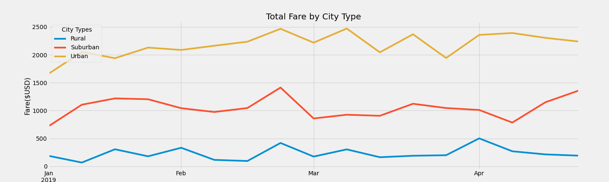

# PyBer Analysis

## Overview

This exploratory data analysis aims to evaluate the metrics for the ridesharing organization, PyBer. A summary dataframe outlines the distribution of drivers and ride counts by city types as well as the average fare for each city type with a graphical representation of the data. 

## Results

The summary dataframe shows the distribution of rides among drivers for each city type from January to April:

-  Rural cities: 125 total rides among 78 drivers
  
 - Suburban cities: 625 total rides among 490 drivers
  
-  Urban cities: 1,625 total rides among 2,405 drivers

The ride count and driver count are significantly lower for the rural cities compared to the suburban and urban cities, making up less than 5% of the driver distribution for the sum of the city types. However, the data shows that the average fare per ride is higher than the other two city types at $34.62. The fare per driver is also significantly higher at $55.49 for the rural cities compared to the suburban and urban cities. The suburban cities show a lower degree of variability in the rideshare metrics. The total number of drivers reported from January to April in suburban cities was 490 with 625 rides given over those months. Of those rides given, the average fare per ride was $30.97 while the average fare per driver was $39.50. The highest number of rides was reported by the urban cities which also accounted for the highest number of drivers. The ratio of total rides given to total drivers available is 1,625 rides to 2,405 drivers. The difference is represented by a greater number of drivers reported than the number of rides, suggesting the possibility of lower driver demand. The average fare per ride is lower than the other two cities at $24.53, and the average fare per drive is lower at $16.57.

The urban cities account for most of the total fares generated with $39,854.38 over the four-month period. 

 - Suburban cities: $19,356 in total fares

 - Rural: $4,327.93 in total fares

The line chart displays the trends for total fares for each city from January to April. For these months, the highest total fares were reported by the urban cities and the lowest total fares were reported by the rural cities. The line chart also shows that during the later weeks of February there is a peak in the fares suggesting an increased demand for rides during this time. A decline in fares is displayed at the start of March and towards the beginning of April. The trend for fares in suburban cities fluctuates to a lesser degree than in rural or urban cities.

## Summary

For the analysis of the results for each city type, the recommendations for addressing disparities among the city types are:

•	Rural cities account for the lowest number of rides and drivers but have the highest average fares. A slight increase in driver count along with focused marketing is recommended to increase total rides to generate greater overall revenue. 

•	The suburban cities consistently performed in the middle of the urban cities and rural cities. The recommendation is to continue monitoring performance but focus efforts on the rural and urban cities to improve their respective performances.

•	Urban cities are the highet performing city type and account for the majority of revenue for Pyber with the most rides and highest number of drivers reported. The recommendation is to invest the most resources in marketing to further attract riders. 

Further analysis to extend the monthly trends of fares by city type is also recommended to identify peaks in the season that can be capitalized on to increase overall revenue in all city types. The demographics of the riders may provide insightful to further orient the focus of marketing efforts.

